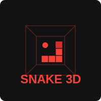

<div align="center">
  
</div>

# Snake 3D

Трехмерная версия классической игры "Змейка", разработанная с использованием HTML, CSS, JavaScript и Three.js.

## 📖 Описание

В этой игре вы управляете змейкой, которая движется в трехмерном пространстве. Цель игры - собирать еду, чтобы змейка росла, и избегать столкновений со стенами и собственным хвостом. Уникальность игры в том, что змейка может перемещаться по всем трем осям (x, y, z), что добавляет новое измерение к классическому геймплею.

## ✨ Особенности

- Полностью трехмерная графика с использованием Three.js
- Управление с клавиатуры для перемещения в трех измерениях
- Постепенное увеличение сложности с ростом счета
- Современный пользовательский интерфейс
- Поддержка русской и английской раскладки клавиатуры

## 🔧 Технологии

- HTML5
- CSS3
- JavaScript (ES6+)
- Three.js для 3D-графики
- Vite для сборки проекта
- Docker и Docker Compose для разработки

## 🚀 Быстрый старт

### Онлайн-демо

Попробуйте игру онлайн: [Snake 3D Demo](https://your-username.github.io/snake-3d/)

### Запуск локально

#### Требования

- Docker и Docker Compose
- или Node.js 18+ и npm/yarn

#### С использованием Docker:

1. Клонировать репозиторий:
   ```bash
   git clone https://github.com/your-username/snake-3d.git
   cd snake-3d
   ```

2. Запустить контейнеры:
   ```bash
   docker-compose up -d
   ```

3. Открыть игру в браузере:
   ```
   http://localhost:8085
   ```

#### С использованием NPM/Yarn:

1. Клонировать репозиторий:
   ```bash
   git clone https://github.com/your-username/snake-3d.git
   cd snake-3d
   ```

2. Установить зависимости:
   ```bash
   npm install
   # или
   yarn install
   ```

3. Запустить сервер разработки:
   ```bash
   npm run dev
   # или
   yarn dev
   ```

4. Открыть игру в браузере:
   ```
   http://localhost:3000
   ```

## 🎮 Управление

- **Стрелки**: движение по осям X и Z
- **W/S** или **Ц/Ы**: движение вверх/вниз по оси Y
- **Пробел**: пауза
- **ESC**: меню
- **Enter**: начать заново после проигрыша

## 🏗️ Структура проекта

```
snake-3d/
├── src/              # Исходный код
│   ├── js/           # JavaScript файлы
│   ├── css/          # Стили
│   └── index.html    # Главная страница
├── public/           # Статические файлы
│   └── images/       # Изображения и логотипы
├── docker/           # Файлы для Docker
│   └── nginx/        # Конфигурации Nginx
├── tasks/            # Задачи по проекту
├── .env              # Переменные окружения
└── package.json      # Зависимости NPM
```

## 🚢 Деплой

### GitHub Pages

После форка или клонирования репозитория, вы можете развернуть игру на GitHub Pages:

1. В настройках репозитория включите GitHub Pages для ветки `main`
2. Ваша игра будет доступна по адресу `https://your-username.github.io/snake-3d/`

## 📝 Лицензия

[MIT](LICENSE)

## 🤝 Вклад в проект

Любые вклады в проект приветствуются! Если у вас есть идеи по улучшению игры или вы нашли ошибку, пожалуйста, создайте issue или отправьте pull request. 